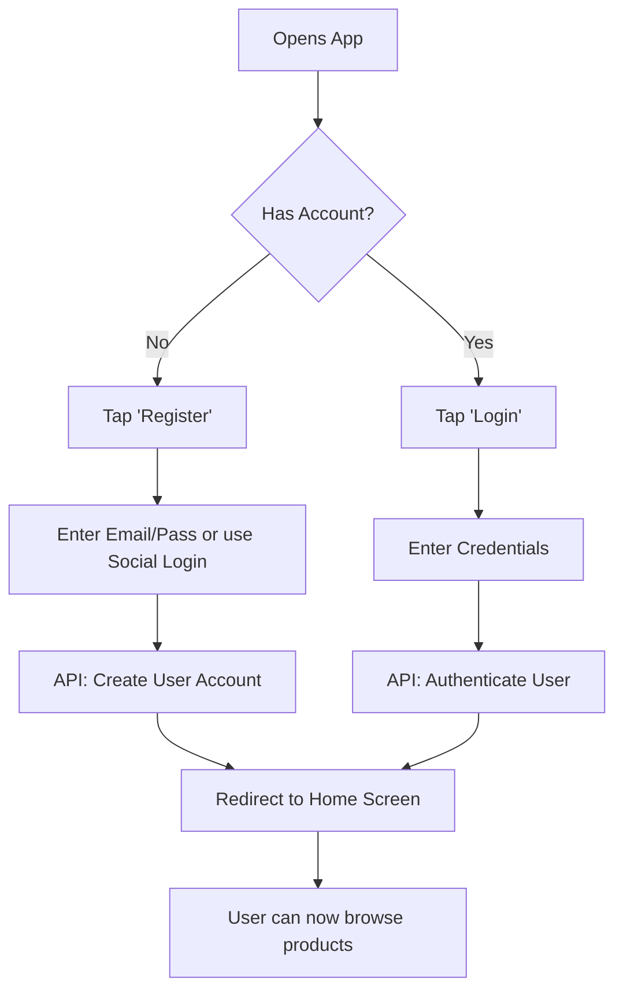

# User & System Flows

This document outlines the primary user flows for the e-commerce mobile application.

## 1. User Onboarding Flow

This flow describes how a new user registers and logs into the application for the first time.



## 2. Purchase Flow

This flow details the steps a user takes from finding a product to completing a purchase.

```mermaid
graph TD
    A[User on Home Screen] --> B[Search or Browse Categories];
    B --> C[View Product List];
    C --> D[Select a Product];
    D --> E[View Product Details];
    E --> F[Select Options (Size/Color)];
    F --> G[Tap 'Add to Cart'];
    G --> H{Continue Shopping or View Cart?};
    H -- Continue Shopping --> B;
    H -- View Cart --> I[Shopping Cart Screen];
    I --> J[Review Items & Total];
    J --> K[Tap 'Proceed to Checkout'];
    K --> L[Enter/Confirm Shipping Address];
    L --> M[Enter Payment Details via Stripe UI];
    M --> N[Tap 'Place Order'];
    N --> O[API: Process Payment & Create Order];
    O --> P[Order Confirmation Screen];
    P --> Q[User receives confirmation email];
```

## 3. Order Tracking Flow

This flow shows how a user can check the status of a past order.

```mermaid
graph TD
    A[User opens app] --> B[Navigate to Profile/My Account];
    B --> C[Tap 'Order History'];
    C --> D[API: Fetch User's Orders];
    D --> E[Display List of Past Orders];
    E --> F[User selects an order];
    F --> G[View Order Details & Status];
    G --> H{Order Shipped?};
    H -- Yes --> I[Display Tracking Information];
    H -- No --> J[Display Status (e.g., 'Processing')];
```
